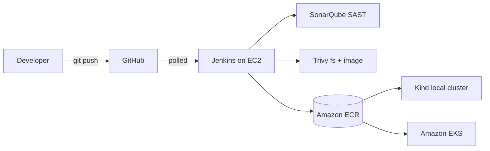

# Production-Grade DevSecOps CI/CD Pipeline on AWS

A hybrid AWS + local-Kubernetes DevSecOps pipeline that demonstrates **shift-left security**, **least-privilege IAM**, and **multi-target deploy** with a single Kustomize bundle.

**Stack**: Python · Flask · Docker · Jenkins · SonarQube · Trivy · Amazon ECR · Amazon EKS · Kind · AWS IAM · Kubernetes RBAC.

---

## What this pipeline actually does

```
git push  →  Jenkins  →  pytest  →  SonarQube SAST  →  Trivy fs scan
       →  Docker build  →  Trivy image scan  →  ECR push
                       →  kubectl apply  →  pods running on K8s
```

The same `kubectl apply -k k8s/base/` deploys to **local Kind** (developer iteration) and to **Amazon EKS** (production-shape demo) — zero application changes between environments.


---

## Architecture



Full diagram + per-component design decisions in **[`docs/architecture/architecture.md`](docs/architecture/architecture.md)**.

---

## Security posture

Every commit is blocked from reaching production if **any** of these gates trips:

| Gate | Tool | Fails build on |
|---|---|---|
| Static code analysis | SonarQube 26 Community | Bugs, vulnerabilities, code smells, hotspots above quality gate |
| Dependency CVEs | Trivy `fs` | HIGH or CRITICAL CVE in `requirements.txt` (fixable only) |
| Hardcoded secrets | Trivy `fs --scanners secret` | Any detected credential pattern |
| IaC misconfiguration | Trivy `fs --scanners misconfig` | Dockerfile/K8s best-practice violations |
| Image OS CVEs | Trivy `image` | HIGH or CRITICAL CVE in Debian/Python layers |
| Image lang CVEs | Trivy `image` | HIGH or CRITICAL CVE in installed Python packages |
| Cloud-native scan | AWS Inspector (ECR scan-on-push) | Secondary layer behind Trivy |


### IAM & runtime hardening

- **EC2 instance role**, never plain-text AWS keys. Pushes to ECR via short-lived STS creds from IMDS.
- **Managed policy scoped to one ECR repo** — verified via deliberate `AccessDenied` on broader actions.
- **IMDSv2 enforced** with `HttpTokens=required` (mitigates SSRF metadata attacks).
- **Restricted Pod Security Standard** at namespace level + non-root UID 10001 + `readOnlyRootFilesystem` + drop all capabilities + `seccompProfile: RuntimeDefault` at pod level.
- **NetworkPolicy default-deny** with scoped allow rules.
- **ServiceAccount + Role + RoleBinding** scaffolded; `automountServiceAccountToken: false` since the app doesn't call the K8s API.

Full per-action policy justification: **[`docs/security/iam-review.md`](docs/security/iam-review.md)**.

---

## Pipeline stages (Build #7)

| # | Stage | Outcome |
|---|---|---|
| 1 | Checkout SCM | Clones `Sarvagya-10/devsecops-pipeline` from GitHub |
| 2 | Checkout info | Logs commit + workspace |
| 3 | Python setup | Creates venv, installs pinned deps |
| 4 | Unit tests | pytest, **3 passed, 100% line coverage on `src/`** |
| 5 | SonarQube SAST | 10 files analyzed, 0 issues, Quality Gate Passed |
| 6 | Trivy filesystem scan | 0 HIGH/CRITICAL, 0 secrets, 0 misconfigs |
| 7 | Docker build | Multi-stage image, 186 MB, tagged `:7` + `:latest` |
| 8 | Trivy image scan | debian 13.5 + 9 Python packages, all 0 CVEs |
| 9 | ECR login | STS via EC2 instance role, no static creds |
| 10 | ECR push | `649966627060.dkr.ecr.us-east-1.amazonaws.com/devsecops-demo:7` |


---

## Multi-target deploy — same manifests, two clusters

### Local — Kind on the developer laptop


### Production-shape — Amazon EKS (one-shot demo)


The EKS cluster was deliberately ephemeral — created with `eksctl`, deployed to, screenshotted, and **fully deleted** the same hour to keep cost under $0.30.


---

## Repository structure

```
app/                          Flask 3 app
  src/                          factory pattern, blueprints, /health + /ready
  tests/                        pytest, 100% line coverage
  Dockerfile                    multi-stage, non-root UID 10001
  pyproject.toml                pytest config
  requirements.txt              pinned

ci/
  Jenkinsfile                   12-stage declarative pipeline

security/
  sonarqube/                    sonar-project.properties at repo root
  trivy/                        .trivyignore at repo root

k8s/
  base/                         namespace, configmap, deployment, service,
                                hpa, networkpolicy, ingress, kustomization
  overlays/dev|prod/            replica + HPA overrides
  rbac/                         serviceaccount, role, rolebinding

infra/
  ec2/user-data.sh              one-shot bootstrap for the build server
  iam/                          IaC for trust + ECR push policy
  ecr/                          repo + lifecycle policy
  eks-optional/                 eksctl ClusterConfig + runbook

local/
  kind-config.yaml              3-node Kind cluster definition
  refresh-ecr-secret.sh         creates/refreshes the 12h ECR pull secret
  README.md                     execution guide for the local cluster

docs/
  architecture/                 high-level + decision rationale
  security/iam-review.md        per-action least-privilege justification
  screenshots/                  portfolio screenshots + INDEX.md

.trivyignore                    triaged CVE accept list (empty)
.gitignore                      blocks .env, AWS creds, kubeconfig from history
sonar-project.properties        SonarQube scanner inputs
```

---

## Quick start (local, no AWS account required)

The Docker image is in a public-friendly shape; you can build and run it locally without any AWS access.

```bash
# 1. Clone
git clone https://github.com/Sarvagya-10/devsecops-pipeline.git
cd devsecops-pipeline

# 2. Build the image
docker build -t devsecops-demo:local app/

# 3. Run it
docker run --rm -p 8080:8080 devsecops-demo:local

# 4. In another terminal
curl http://localhost:8080/health    # {"status":"ok"}
curl http://localhost:8080/ready
curl http://localhost:8080/
```

For the full Kind-based local cluster walk-through, see **[`local/README.md`](local/README.md)**.

For the one-shot EKS demo, see **[`infra/eks-optional/README.md`](infra/eks-optional/README.md)**.

---

## Cost optimization

Built explicitly to stay inside AWS Free Tier.

| Resource | Steady-state cost |
|---|---|
| EC2 (single t3.micro, stopped between sessions) | $0 (Free Tier) |
| EBS gp3 20 GB | Free Tier (30 GB included) |
| Elastic IP (attached) | $0 (Free Tier 750h/mo) |
| Amazon ECR (under 500 MB) | $0 (Free Tier) |
| IAM (user, role, policy) | Always free |
| **Local Kind cluster** | $0 (runs on developer laptop) |
| EKS one-shot demo (~30 min total runtime) | ~$0.10 once, then deleted |

Total project AWS spend so far: **under $1**.

---

## Phase log

| Phase | Topic | Status |
|---|---|---|
| 1 | Project planning & architecture | ✅ |
| 2 | Flask app + hardened Dockerfile | ✅ |
| 3 | EC2 build server + Jenkins/Sonar/Trivy/Docker/AWS CLI install | ✅ |
| 4 | Jenkins pipeline (test + build) | ✅ |
| 5 | SonarQube SAST integration + Quality Gate | ✅ |
| 6 | Trivy filesystem + image scan integration | ✅ |
| 7 | Amazon ECR repo + IAM least-privilege role + pipeline push | ✅ |
| 8 | Kind cluster on developer laptop | ✅ |
| 9 | K8s manifests (deployment/service/HPA/NetworkPolicy/Ingress) | ✅ |
| 10 | IAM review document | ✅ |
| 11 | Kubernetes RBAC (ServiceAccount/Role/RoleBinding) | ✅ |
| 12 | One-shot EKS demo (created → deployed → screenshotted → deleted) | ✅ |
| 13 | Architecture diagram + this README | ✅ |
| 14 | Resume bullets (separate doc) | pending |
| 15 | Interview prep Q&A (separate doc) | pending |

---

## License

MIT — see [`LICENSE`](LICENSE) (to be added).
