# Architecture

## High-level data flow

```mermaid
flowchart LR
    Dev["Developer<br/>(local laptop)"] -->|git push| GH[GitHub<br/>Sarvagya-10/devsecops-pipeline]
    GH -->|polled by Jenkins| J["Jenkins<br/>EC2 t3.micro"]

    subgraph CI ["CI / CD pipeline on EC2"]
      J --> S1[Unit tests<br/>pytest 100% cov]
      S1 --> S2["SonarQube SAST<br/>Quality Gate"]
      S2 --> S3["Trivy fs scan<br/>deps + secrets + IaC"]
      S3 --> S4["Docker build<br/>multi-stage, non-root"]
      S4 --> S5["Trivy image scan<br/>OS + Python pkgs"]
      S5 --> S6["ECR login<br/>via IMDS role"]
      S6 --> S7["ECR push<br/>tag = build #"]
    end

    S7 --> ECR[(Amazon ECR<br/>private, AES-256,<br/>scan-on-push)]
    ECR -->|kubectl apply -k k8s/base/| Kind["Kind cluster<br/>local laptop"]
    ECR -->|kubectl apply -k k8s/base/<br/>same manifests, no changes| EKS["Amazon EKS<br/>2 x t3.small<br/>(one-shot demo)"]

    classDef aws fill:#FF9900,stroke:#333,color:#fff;
    classDef green fill:#4CAF50,stroke:#333,color:#fff;
    classDef k8s fill:#326CE5,stroke:#333,color:#fff;
    class J,ECR,EKS aws;
    class S2,S3,S5 green;
    class Kind,EKS k8s;
```

## Why this shape

Two security guards, one image, two targets.

1. **Two security guards** — SonarQube (looks at source code) and Trivy (looks at dependencies + image layers). Either one finding a HIGH or CRITICAL kills the build *before* the image leaves the CI runner.

2. **One image** — built once, scanned twice (Trivy on the local daemon + AWS Inspector after ECR push), tagged with `BUILD_NUMBER`, immutable in practice.

3. **Two targets** — exactly the same `kubectl apply -k k8s/base/` deploys to local Kind for dev iteration **and** to managed EKS for production-shape demos. Zero per-environment code changes.

## Per-component decisions

### EC2 build server (single t3.micro)

| Decision | Why |
|---|---|
| One instance, not many | Stay inside the AWS Free Tier 750 hr/mo. |
| Jenkins runs as a Docker container, not apt | Jenkins's apt repo GPG keys rotate frequently; the container image avoids that maintenance burden. |
| Self-hosted bare git repo under `/srv/git/devsecops.git` | Demonstrates the air-gapped/enterprise pattern where source control must remain inside the build server. Used as a secondary remote alongside GitHub. |
| 4 GB swap added in user-data | SonarQube wants ~2 GB RAM. The instance has 1 GB. Swap lets it run, slowly but reliably. |
| IMDSv2 enforced, hop limit 2 | IMDSv2 mitigates SSRF attacks against the metadata service (the Capital One breach class). Hop limit 2 lets the Jenkins container reach IMDS through the Docker bridge. |

### Image (Python 3.12-slim, multi-stage)

| Decision | Why |
|---|---|
| Multi-stage build (builder + runtime) | Build tooling stays in builder; runtime contains only what gunicorn needs. |
| `python:3.12-slim` base, not full python | ~75% smaller image, smaller attack surface. |
| Non-root user UID 10001 with `/sbin/nologin` | Required by the Kubernetes Restricted Pod Security Standard. Defeats container-escape-to-root. |
| `HEALTHCHECK` via stdlib `urllib`, no `curl` install | Same effect, one less binary in the image. |
| `PYTHONDONTWRITEBYTECODE=1`, `PYTHONUNBUFFERED=1` | No `.pyc` writes during runtime; stdout flushes immediately for `kubectl logs`. |

### Amazon ECR

| Decision | Why |
|---|---|
| Private repository | Default-deny, IAM-gated pulls. |
| `scanOnPush: true` | Free AWS Inspector scan on every push, as a second layer behind Trivy. |
| Encryption AES-256 | Encryption at rest is a baseline compliance ask. |
| Lifecycle policy: keep 5 newest tagged, expire untagged after 1 day | Caps storage cost long-term; avoids the "100 dangling images" anti-pattern. |

### IAM

| Decision | Why |
|---|---|
| EC2 uses an instance role, not access keys | No long-lived AWS credentials anywhere in the codebase or Jenkins config. STS hands the role short-lived creds via IMDS. |
| Managed policy `devsecops-ecr-push-policy` is **scoped to one repo** | The role can push and pull only `devsecops-demo`. Listing other repos returns `AccessDenied` — verified during Phase 7. |
| Trust policy is the EC2 service, nothing else | No cross-account trust, no IAM user trust. |
| `ecr:GetAuthorizationToken` is the only `Resource: "*"` action | AWS does not allow scoping this action; documented as the single exception. |

See [`docs/security/iam-review.md`](../security/iam-review.md) for the full per-action justification.

### Kubernetes manifests

| Decision | Why |
|---|---|
| Pod Security Standard `restricted` enforced on the namespace | Defense-in-depth — denies any pod that omits non-root, readOnlyRootFilesystem, etc. |
| `runAsNonRoot`, UID 10001, `readOnlyRootFilesystem`, drop ALL caps, `seccompProfile: RuntimeDefault` | Same Restricted PSS controls applied at the pod level. |
| `automountServiceAccountToken: false` | The app doesn't call the Kubernetes API. Don't mount a token it doesn't need. |
| Resource requests + limits including `ephemeral-storage` | CPU + memory + storage all bounded. Prevents one bad pod from saturating a node. |
| Image pinned via Kustomize `images:` newTag, not `:latest` | Reproducible deploys; effectively-immutable tag means `imagePullPolicy: IfNotPresent` is safe. |
| Liveness + readiness + startup probes | Liveness restarts wedged pods; readiness gates traffic; startup gives gunicorn 60s to come up. |
| RBAC: dedicated `ServiceAccount`, `Role`, `RoleBinding` | Scaffolding for least-privilege when the app starts needing API access. Role scoped by `resourceNames` to the app's own ConfigMap. |
| NetworkPolicy: default-deny + scoped allow | Only ingress from `ingress-nginx` and same-namespace pods; egress only DNS to kube-system. (Kindnet doesn't enforce these; Calico/AWS VPC CNI does.) |

### Multi-target deploy (Kind + EKS, same manifests)

The same `k8s/base/` kustomize bundle works on both. The only difference is **how the image gets pulled**:

- **Kind**: a `kubectl secret` named `ecr-creds` is created in the namespace using a 12-hour token from `aws ecr get-login-password`. Refreshed by `local/refresh-ecr-secret.sh`.
- **EKS**: the worker node IAM role auto-includes `AmazonEC2ContainerRegistryReadOnly`, so the kubelet pulls without any pod-level secret. The `imagePullSecrets` reference in the deployment is silently ignored when the secret doesn't exist.

A real production EKS setup would use **IAM Roles for Service Accounts (IRSA)** to scope pull permissions to specific pods, but that's out of scope for a one-shot demo.

## What was deliberately left out

| Skipped | Reason |
|---|---|
| Load Balancer service on EKS | Costs ~$0.02/hr extra. Port-forward + curl proves the app works end-to-end. |
| ArgoCD / GitOps | Adds another running service; the Jenkins → ECR → kubectl flow already demonstrates CD. |
| Helm charts | Kustomize covers the same templating need with less ceremony for a small project. |
| Sealed Secrets / External Secrets | We don't have application secrets in this demo (no DB password, no API keys). |
| OIDC + IRSA on EKS | Phase 12 was deliberately one-shot; IRSA is a Phase 13.5+ enhancement. |
| Custom Jenkins image with pre-baked tools | Documented as tech debt. Current flow installs Python, Docker CLI, Sonar Scanner, Trivy, and AWS CLI via `docker exec` after first boot. |
